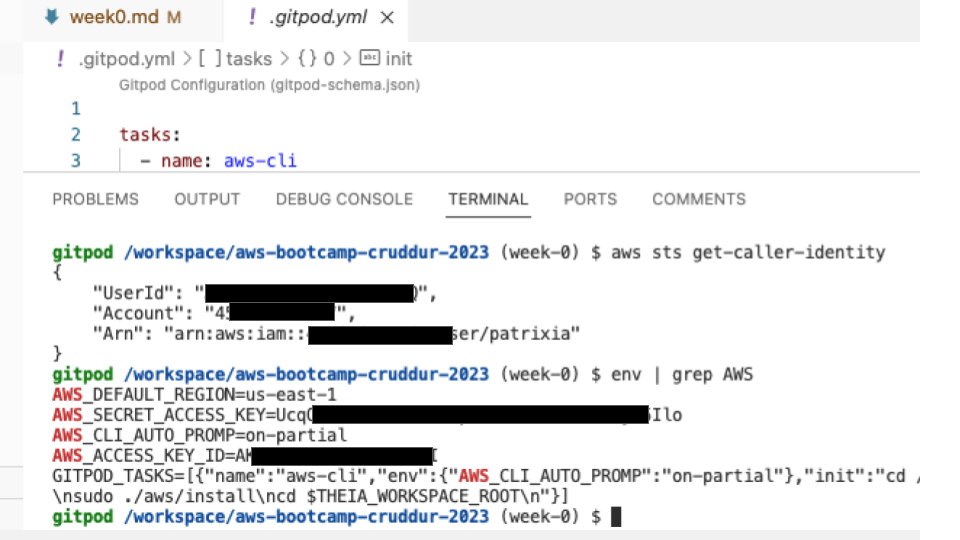
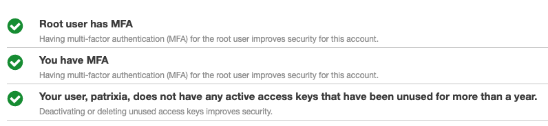
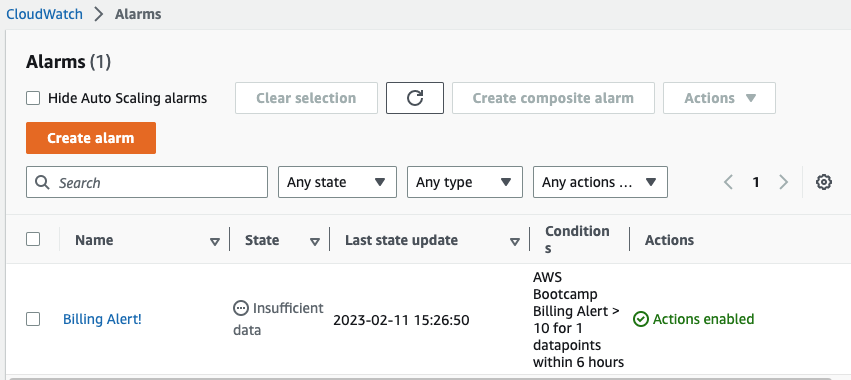
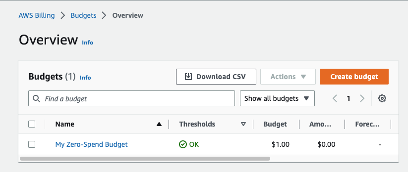
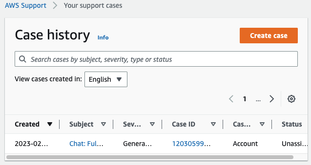

# Week 0 — Billing and Architecture

Required Homework/Tasks


* Added MFA to the root user
* Created an IAM user with Administrator privileges
  * Generated IAM Credentials for the user



  * Added MFA to the user



* Created an AWS Billing Alarm



* Created an AWS Budget



* Used CloudShell
  * I've used CloudShell before (in GCP, at least), but I'm still figuring out an error I get when I try to open CloudShell in the AWS Console.
  * The error is `Unable to start the environment. To retry, refresh the browser or restart by selecting Actions, Restart AWS CloudShell`, and I've followed everything in https://repost.aws/questions/QU0fc_9kRWSF662purgwEacg/unable-to-start-the-environment-to-retry-refresh-the-browser-or-restart-by-selecting-actions-restart-aws-cloud-shell, and no luck, so I opened a Support case:




* Created a conceptual diagram in Lucid Charts 
  * [Diagram Link](https://lucid.app/lucidchart/2700bf74-923b-442a-b09c-5b4fc3cad86d/edit?viewport_loc=-651%2C-789%2C3200%2C2411%2C0_0&invitationId=inv_0809de19-3318-4899-a4f1-7b0fd7725991)
* Created a logical architectural diagram in Lucid Charts
  * [Diagram Link](https://lucid.app/lucidchart/2b16e266-b6e1-4fd4-9890-efc302f13675/edit?viewport_loc=-112%2C-13%2C2064%2C1479%2C0_0&invitationId=inv_261d1e0f-df48-46e6-a81c-9c356915f880)


* Added commands to automatically install the AWS CLI everytime I launch a gitpod workspace:
  ```
  tasks:
  - name: aws-cli
    env:
      AWS_CLI_AUTO_PROMP: on-partial
    init: |
      cd /workspace
      curl "https://awscli.amazonaws.com/awscli-exe-linux-x86_64.zip" -o "awscliv2.zip"
      unzip awscliv2.zip
      sudo ./aws/install
      cd $THEIA_WORKSPACE_ROOT
  ```
* Made the IAM Credentials for the new user available to the gitpod workspace using `gp env`