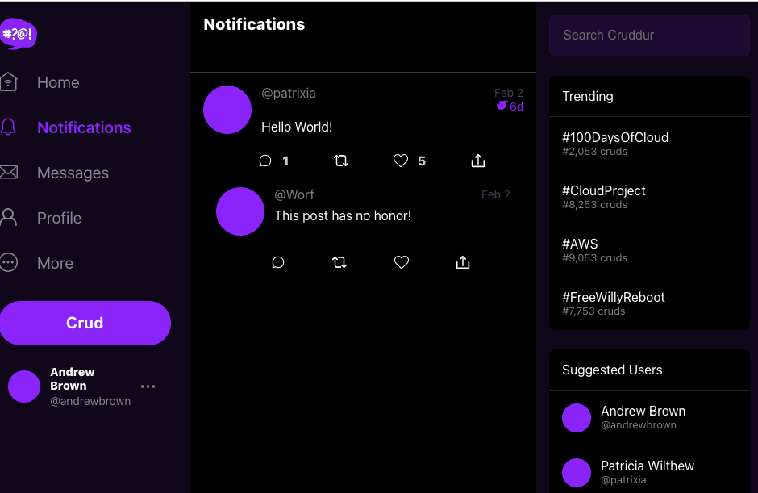

# Week 1 — App Containerization

* Wrote a Docker file for the backend and the frontend

    * [../backend-flask/Dockerfile](../backend-flask/Dockerfile)
    * [../frontend-react-js/Dockerfile](../frontend-react-js/Dockerfile)

* Wrote a Docker Compose file

    * [../docker-compose.yml](../docker-compose.yml)

* Documented the new API endpoint, Notifications, in OpenAPI

    * [../backend-flask/openapi-3.0.yml](../backend-flask/openapi-3.0.yml)

    ```
      /api/activities/notifications:
    get:
      description: 'Return a feed of activity for accounts I follow'
      tags:
        - activities
      responses: 
        '200':
          description: 'Returns an array of activities'
          content:
            application/json:
              schema:
                type: array
                items:
                  $ref: '#/components/schemas/Activity'

    ```

* Created a service that returns fake notifications

    * [../backend-flask/services/notifications_activities.py](../backend-flask/services/notifications_activities.py)

* Took care of all the compiler warnings in the front end

    * https://github.com/pwilthew/aws-bootcamp-cruddur-2023/commit/e8bafe195450d524d6ef4e26b8f8cea0671d9c85

* Verified the front-end and the back-end are working well together for *Notifications*

    
