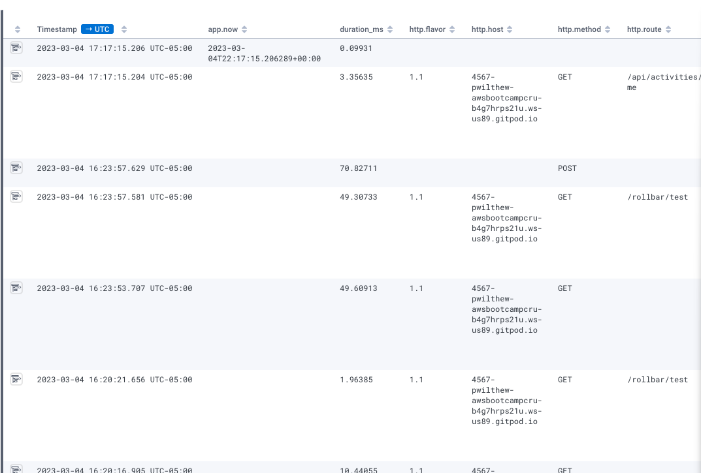
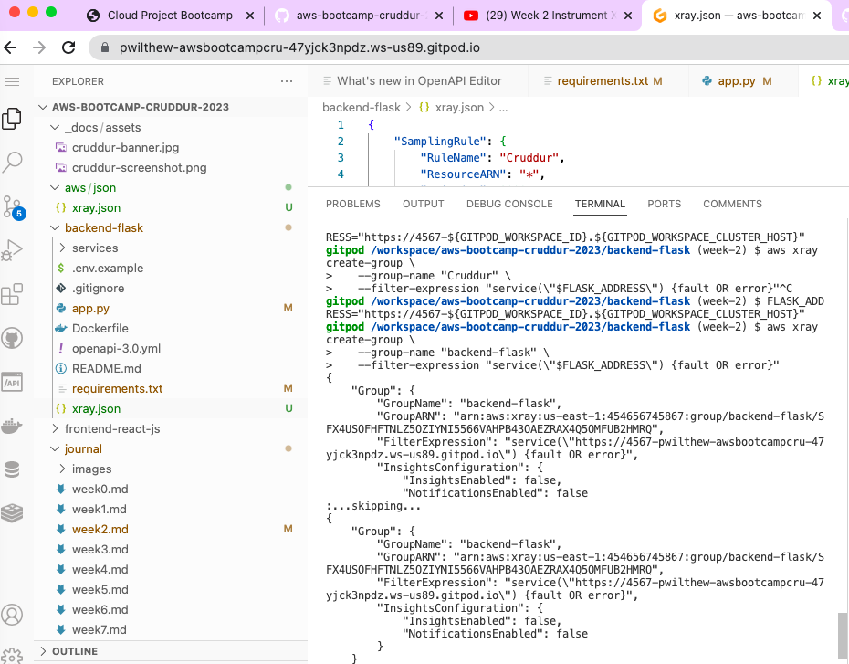
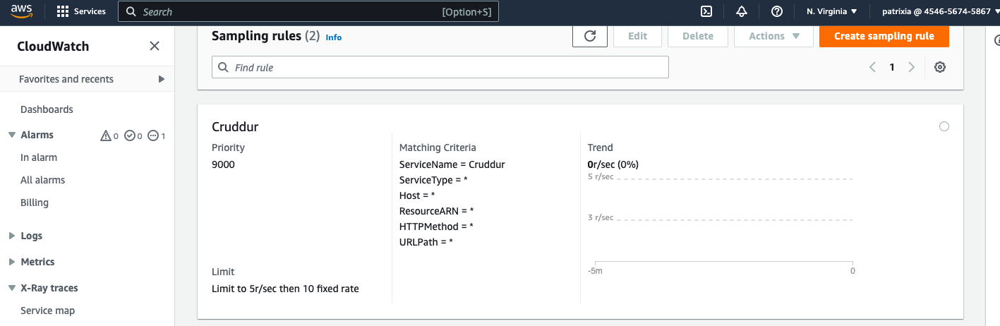
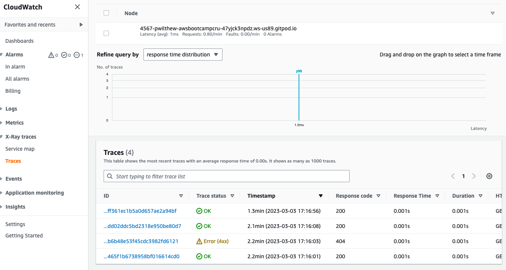
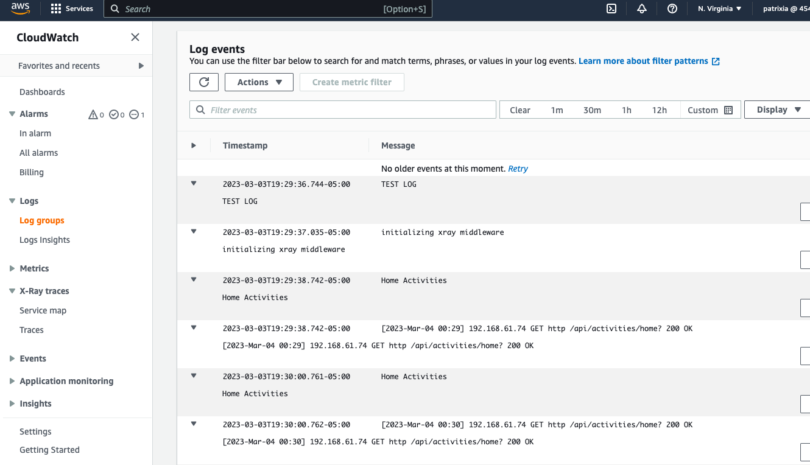
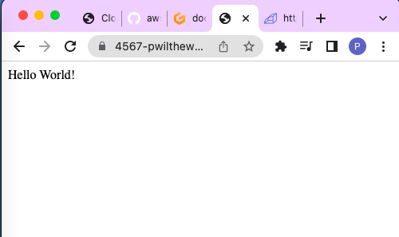
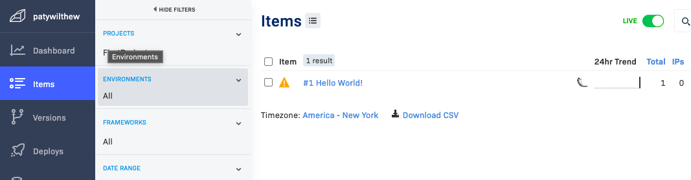

# Week 2 — Distributed Tracing

## Instrument Honeycomb with OTEL

* I set  the API key for Honeycomb in my gitpod environment 

```
export HONEYCOMB_API_KEY="XXX"
gp env HONEYCOMB_API_KEY="XXX"
export HONEYCOMB_SERVICE_NAME="Cruddur"
gp env HONEYCOMB_SERVICE_NAME="Cruddur"
```

* Added env vars to the `docker-compose.yml` file
  * Open Telemetry to send to Honeycomb

  ```
  OTEL_SERVICE_NAME: "backend-flask"
  OTEL_EXPORTER_OTLP_ENDPOINT: "https://api.honeycomb.io"
  OTEL_EXPORTER_OTLP_HEADERS: "x-honeycomb-team=${HONEYCOMB_API_KEY}"
  ```

* Added Open Telemetry Python dependencies to `requirements.txt`

```
opentelemetry-api 
opentelemetry-sdk 
opentelemetry-exporter-otlp-proto-http 
opentelemetry-instrumentation-flask 
opentelemetry-instrumentation-requests
```

* Added to `backend/app.py`:

```py
# Honeycomb
from opentelemetry import trace
from opentelemetry.instrumentation.flask import FlaskInstrumentor
from opentelemetry.instrumentation.requests import RequestsInstrumentor
from opentelemetry.exporter.otlp.proto.http.trace_exporter import OTLPSpanExporter
from opentelemetry.sdk.trace import TracerProvider
from opentelemetry.sdk.trace.export import BatchSpanProcessor
```

```py
# Initialize automatic instrumentation with Flask
FlaskInstrumentor().instrument_app(app)
RequestsInstrumentor().instrument()
```

* This is a screenshot of a query's results in Honeycomb:



## Instrument AWS X-Ray

* Added to the requirements.txt: `aws-xray-sdk`

* Added to app.py

  ```py
  from aws_xray_sdk.core import xray_recorder
  from aws_xray_sdk.ext.flask.middleware import XRayMiddleware

  xray_url = os.getenv("AWS_XRAY_URL")
  xray_recorder.configure(service='Cruddur', dynamic_naming=xray_url)
  XRayMiddleware(app, xray_recorder)
  ```

* Added aws/json/xray.json

```json
{
  "SamplingRule": {
      "RuleName": "Cruddur",
      "ResourceARN": "*",
      "Priority": 9000,
      "FixedRate": 0.1,
      "ReservoirSize": 5,
      "ServiceName": "Cruddur",
      "ServiceType": "*",
      "Host": "*",
      "HTTPMethod": "*",
      "URLPath": "*",
      "Version": 1
  }
}
```

* Created X Ray group

  ```  
  aws xray create-group \
  --group-name "backend-flask" \
  --filter-expression "service(\"backend-flask\") {fault OR error}"
  ```



* Created sampling rule: `aws xray create-sampling-rule --cli-input-json file://aws/json/xray.json`   



* Added daemon service to docker compose

  ```
  xray-daemon:
  image: "amazon/aws-xray-daemon"
  environment:
    AWS_ACCESS_KEY_ID: "${AWS_ACCESS_KEY_ID}"
    AWS_SECRET_ACCESS_KEY: "${AWS_SECRET_ACCESS_KEY}"
    AWS_REGION: "us-east-1"
  command:
    - "xray -o -b xray-daemon:2000"
  ports:
    - 2000:2000/udp
  ```

* Added ENV variables to docker compose

```
  AWS_XRAY_URL: "*4567-${GITPOD_WORKSPACE_ID}.${GITPOD_WORKSPACE_CLUSTER_HOST}*"
  AWS_XRAY_DAEMON_ADDRESS: "xray-daemon:2000"
```

* Ta-dah




## Configure custom logger to send to CloudWatch Logs

* Added to requirements.txt:

`watchtower`

* Added to app.py

```py
import watchtower
import logging
from time import strftime
```

```py
LOGGER = logging.getLogger(__name__)
LOGGER.setLevel(logging.DEBUG)
console_handler = logging.StreamHandler()
cw_handler = watchtower.CloudWatchLogHandler(log_group='cruddur')
LOGGER.addHandler(console_handler)
LOGGER.addHandler(cw_handler)
LOGGER.info("some message")
```

```py
@app.after_request
def after_request(response):
    timestamp = strftime('[%Y-%b-%d %H:%M]')
    LOGGER.error('%s %s %s %s %s %s', timestamp, request.remote_addr, request.method, request.scheme, request.full_path, response.status)
    return response
```

* Added to home_activities.py:

```py
logger.info("Home Activities")
```

* And ta-dah, this was definitely the easiest:



## Integrate Rollbar and capture and error

* In https://rollbar.com/, created a new project in Rollbar called Cruddur

* Added the following to requirements.txt

```
blinker
rollbar
```

* Set the rollbar token in our gitpod env

```sh
export ROLLBAR_ACCESS_TOKEN=""
gp env ROLLBAR_ACCESS_TOKEN=""
```

* Added to backend-flask for docker-compose.yml

`ROLLBAR_ACCESS_TOKEN: "${ROLLBAR_ACCESS_TOKEN}"`

* Added Rollbar imports and function to app.py

```py
import rollbar
import rollbar.contrib.flask
from flask import got_request_exception
```

```py
rollbar_access_token = os.getenv('ROLLBAR_ACCESS_TOKEN')
@app.before_first_request
def init_rollbar():
    """init rollbar module"""
    rollbar.init(
        # access token
        rollbar_access_token,
        # environment name
        'production',
        # server root directory, makes tracebacks prettier
        root=os.path.dirname(os.path.realpath(__file__)),
        # flask already sets up logging
        allow_logging_basic_config=False)

    # send exceptions from `app` to rollbar, using flask's signal system.
    got_request_exception.connect(rollbar.contrib.flask.report_exception, app)
```

* Added an endpoint just for testing rollbar to app.py

```py
@app.route('/rollbar/test')
def rollbar_test():
    rollbar.report_message('Hello World!', 'warning')
    return "Hello World!"
```



* The error made it to Rollbar:

