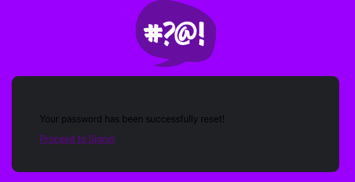
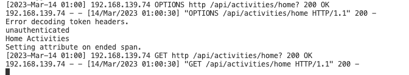

# Week 3 — Decentralized Authentication

## Provision via ClickOps a Amazon Cognito User Pool

Set a very basic and simple AWS Cognito User pool.


## Install and configure Amplify client-side library for Amazon Congito

The front end javascript pages are now using `import { Auth } from 'aws-amplify';`, and environment vars were set in order to reach the new Amazon Cognito User Pool.

```
      REACT_APP_AWS_COGNITO_REGION: "{AWS_DEFAULT_REGION}"
      REACT_APP_AWS_USER_POOLS_ID: "us-east-1_6QlA9PV43"
      REACT_APP_CLIENT_ID: "16l8fdlh5m2r2m0tk5nglcqe5k"
```

## Implement API calls to Amazon Coginto for custom login, signup, recovery and forgot password page

The SigininPage, SignupPage, RecoverPage, were modified for integration with Cognito.

Now a user can register themselves, can log in, and can recover their account when their password is forgotten.





## Show conditional elements and data based on logged in or logged out

We can now control that certain elements are only shown to authenticated users.


## Verify JWT Token server side to serve authenticated API endpoints in Flask Application

We can validate JWT in the backend.




