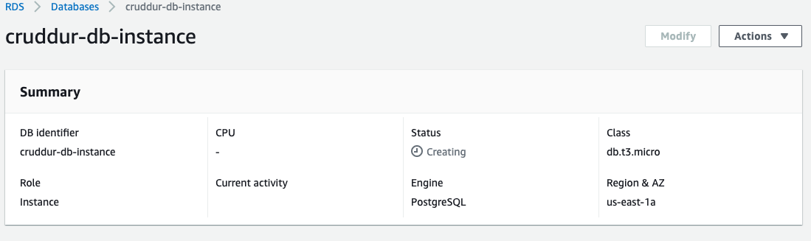
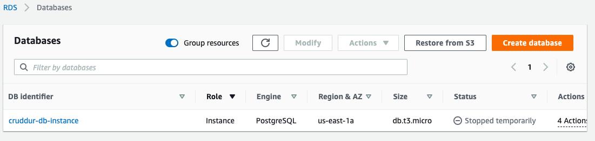
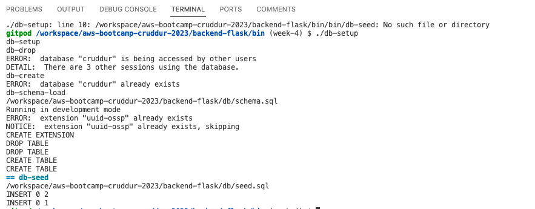
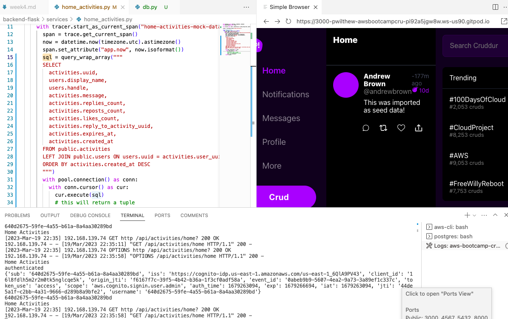
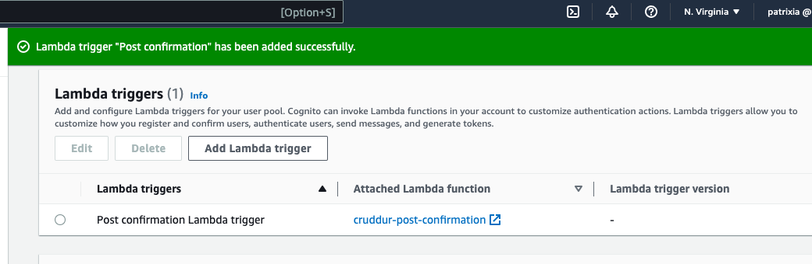
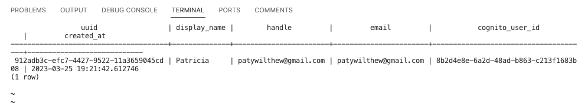

# Week 4 — Postgres and RDS

## Provision an RDS instance

```
aws rds create-db-instance \
  --db-instance-identifier cruddur-db-instance \
  --db-instance-class db.t3.micro \
  --engine postgres \
  --engine-version  14.6 \
  --master-username root \
  --master-user-password $PASSWORD \
  --allocated-storage 20 \
  --availability-zone us-east-1a \
  --backup-retention-period 0 \
  --port 5432 \
  --no-multi-az \
  --db-name cruddur \
  --storage-type gp2 \
  --publicly-accessible \
  --storage-encrypted \
  --enable-performance-insights \
  --performance-insights-retention-period 7 \
  --no-deletion-protection
```



## Temporarily stop an RDS instance



## Remotely connect to RDS instance


## Create a schema SQL file by hand

The following is for Postgres to generate out UUIDs.


backend-flask/db/schema.sql
```sql
CREATE EXTENSION "uuid-ossp";
CREATE EXTENSION IF NOT EXISTS "uuid-ossp";
```

```
gitpod /workspace/aws-bootcamp-cruddur-2023 (week-4) $ psql cruddur < backend-flask/db/schema.sql -h localhost -U postgres
Password for user postgres: 
CREATE EXTENSION
NOTICE:  extension "uuid-ossp" already exists, skipping
CREATE EXTENSION
```

## Write several bash scripts for database operations

Created the following bash scripts:
* db-create
* db-drop
* db-schema-load
* db-sessions
* db-seed
* and db-setup (which executes the others)



## Implement a postgres client for python using a connection pool

Read from the postgres database for the Home Activities page.



## Connect Gitpod to RDS Instance

```
GITPOD_IP=$(curl ifconfig.me)
```

```
export DB_SG_ID="sg-055c6fc61826b8a6e"
gp env DB_SG_ID="sg-055c6fc61826b8a6e"
export DB_SG_RULE_ID="sgr-06920401c756c5e5a"
gp env DB_SG_RULE_ID="sgr-06920401c756c5e5a"
```

```
aws ec2 modify-security-group-rules \
    --group-id $DB_SG_ID \
    --security-group-rules "SecurityGroupRuleId=$DB_SG_RULE_ID,SecurityGroupRule={IpProtocol=tcp,FromPort=5432,ToPort=5432,CidrIpv4=$GITPOD_IP/32}"
```

Added the following to gitpod.yml
```
  - name: rds
    command: |
      export GITPOD_IP=$(curl ifconfig.me)
      source "$THEIA_WORKSPACE_ROOT/backend-flask/rds-update-sg"
```

# Create AWS Cognito trigger to insert user into database

Created a lambda with the layer at the following address as it is in my region:

- arn:aws:lambda:us-east-1:898466741470:layer:psycopg2-py38:2



Successfully registered a user and triggered the lambda function to add the user to the database:


